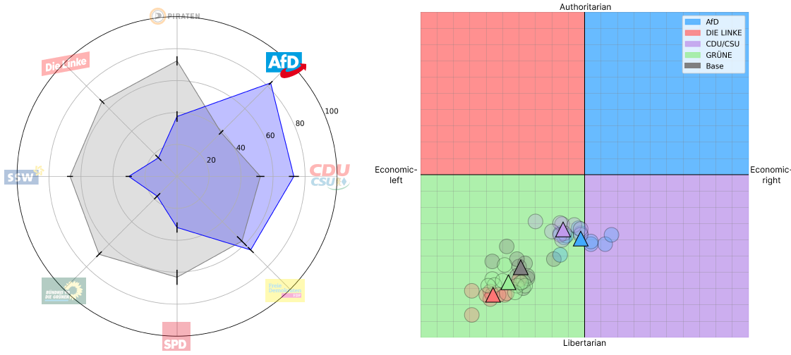

# PoliticalLLM: Framework for Measuring and Manipulating Political Ideologies in LLMs
<p align="center">
  
</p>

Code for the master's thesis _“Steering Large Language Models towards Political Ideologies on Prompt-Level”_. Demo is available [here](huggingface.co/spaces/jost/PoliticalLLM).
This framework automatically evaluates the political ideology of LLMs with two ideology tests: [Wahl-O-Mat](https://www.wahl-o-mat.de/bundestagswahl2021/app/main_app.html) and [Political Compass Test](https://www.politicalcompass.org/test/de). You can evaluate a base model or a manipulated model. Manipulation is done through Prompt Enginnering and RAG. The model can be directly steered towards a target <b>German</b> political party (impersonation) or indirectly (RAG with most similar contexts from manifesto database or random ideological triggers from same database). For the RAG model, <b>German</b> manifesto data from the [Manifesto Project](https://manifesto-project.wzb.eu/) is embedded and saved in a Chroma vector database.

## Quickstart
Create a new venv (Python 3.9.18) and clone the repo. (Note: Make sure to have enough disk space as the script downloads a sentence embedding model)

`git clone https://github.com/j0st/PoliticalLLM`

Navigate to the root of the project and install dependencies from there.

`pip install -r requirements.txt`

To run this project with API models, you will need to add the following environment variables to your `.env` file. Create this file in the root directory of the project. By default, [OpenAI](https://openai.com/blog/openai-api), [together.ai](https://www.together.ai/products#inference) and [Anyscale](https://www.anyscale.com/endpoints) API endpoints are integrated.
```plaintext
# .env file

# Models
OPENAI_API_KEY=""

ANYSCALE_API_KEY=""
ANYSCALE_BASE_URL="https://api.endpoints.anyscale.com/v1"

TOGETHER_AI_API_KEY=""
TOGETHER_AI_BASE_URL="https://api.together.xyz/v1"

# Set this if you want to use your own llama.cpp model locally
LOCAL_LLAMA_MODEL_PATH=""

# Data
MANIFESTO_PROJECT_API_KEY=""
```

Testing can be done in a new Python file or in the existing `main.py`. After importing the LLM class from this project, you can create an instance with the desired LLM and call the ideology test methods. <b>Parameters values and explanations can be found below</b>.
```python
# main.py

from llms import LLM

ChatGPT = LLM("gpt-3.5-turbo-0125")

ChatGPT.wahlomat(filename="YOUR_FILENAME", plot_results=True)
ChatGPT.pct(filename="YOUR_FILENAME", plot_results=True)
```

After finishing the tests, the following files are created in the results folder:

* `responses-YOUR_FILENAME.csv` - Lists all (mapped) responses from the LLM to each political statement.
* `descriptives-YOUR_FILENAME.csv` - Descriptive stats for each statement answered by the LLM.
* `plot-YOUR_FILENAME.png` - Plot of the results.

## Project Structure

    .
    ├── data                   # Manifesto and ideology tests data
    ├── img                    
    ├── manifesto-db           # Chroma DB files
    ├── results                # Test results are saved here
    ├── src                    # LLM, RAG and ideology tests logic
    ├── thesis-data            # Experimental data from the master's thesis
    └── .gitattributes
    └── .gitignore
    └── .README.md
    └── __init__.py
    └── requirements.txt

## Project Files Description

<ul>
  <li><b>src/main.py</b> - Used to run experiments with LLMs.</li>
  <li><b>src/llms.py</b> - Base class for implementing LLMs and ideology tests as methods.</li>
  $~$
  <li><b>src/tests/pct.py</b> - Selenium script to run the PCT test.</li>
  <li><b>src/tests/wahlomat.py</b> - Calculates the agreement scores between parties.</li>
  $~$
  <li><b>src/rag/retriever.py</b> - Retrieves top k statement from manifesto database (RAG).</li>
</ul>

### Some other supporting files
<ul>
  <li><b>src/map_answers.py</b> - Maps the answers from an LLM to the ideology tests (e.g. "Agree") to int values which are needed to do the ideology test.</li>
  $~$
  <li><b>src/analysis/descriptives.py</b> - Calculates the mean, median, mode and std in the list of responses provided after iterating through the statements.</li>
  <li><b>src/analysis/pct_plot_spectrum.py</b> - Plots the PCT coordinates on a two-dimensional spectrum.</li>
  <li><b>src/analysis/wahlomat_radar_chart.py</b> - Plots the Wahl-O-Mat agreements scores between parties on a radar chart.</li>
  $~$
  <li><b>src/rag/embeddings/chunking.py</b> - Chunks manifesto data for embedding model.</li>
  <li><b>src/rag/embeddings/embeddings.py</b> - Creates Chroma.db embeddings from manifesto dataset.</li>
  <li><b>src/rag/embeddings/synthetic_dataset.py</b> - Generates a synthetic QA pair dataset.</li>
  <li><b>src/rag/embeddings/evaluation.py</b> - Evaluates embedding model against validation synthetic dataset.</li>
  <li><b>src/rag/embeddings/fine_tuning.ipynb</b> - Script for fine-tuning embedding model.</li>
  $~$
  <li><b>data/scripts/manifesto_project.py</b> - Get manifesto data from Manifesto Project API.</li>
</ul>

## `.pct()` and `.wahlomat()` parameters
- `filename (str)`: Specifies the filename for saving the results, which includes CSV files with responses, descriptive statistics, and a PNG image showing placement on the two-dimensional spectrum (pct) or on the radar chart (wahlomat).
- `party (Optional[str])`: When set, the prompt is modified to impersonate the given political party. Default is `None`.
- `ideology (Optional[str])`: Works only in conjunction with `rag=True`. It restricts retrieved context to a specific ideology. Possible values include "Authoritarian-right", "Authoritarian-left", "Libertarian-left", "Libertarian-right". Default is `None`.
- `n_results (Optional[int])`: Applicable when `rag=True`. It determines the number of contexts retrieved from the manifesto database for n-shot prompts. Default is `None`.
- `rag (bool)`: Enables the Retrieval Augmented Generation pipeline, inserting retrieved contexts from a vector database into the prompt. Default is `False`.
- `rag_mode (Optional[str])`: Specifies the mode of operation for the RAG pipeline. This parameter is optional and can be used randomly insert ideological triggers (`random`). Default is `similarity`.
- `plot_result (Optional[bool])`: If `True`, the results are plotted and saved in a specified data folder. Default is `False`. Please note that Selenium is used to calculate the coordinates of the PCT. It might throw exceptions due to unexected browser changes. In these cases, the script tries again until successful.
- `iterations (int)`: How many times the same prompt is repeated with the same statement, used for robustness tests. Default is `1`.

## Supported Models

- [gpt-3.5-turbo-0125](https://platform.openai.com/docs/models/gpt-3-5-turbo) (via OpenAI API)
- [Mixtral-8x7B-Instruct-v0.1](https://huggingface.co/mistralai/Mixtral-8x7B-Instruct-v0.1) (via Anycale API)
- [Qwen1.5-14B-Chat](https://huggingface.co/Qwen/Qwen1.5-14B-Chat) (via Together.ai API)

## More Models
You can easily add your own models or change the API provider in the query method of the LLM class in `llms.py`. Just make sure that the query method returns the response in a string.

## Demo
You can try a demo of the different prompt manipulations for different LLMs on [huggingface.co/spaces/jost/PoliticalLLM](huggingface.co/spaces/jost/PoliticalLLM).
Note that Hugging Face Spaces need to restart after some inactivity time which takes a few minutes.
